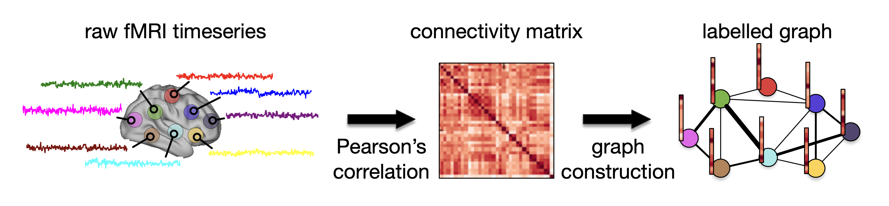
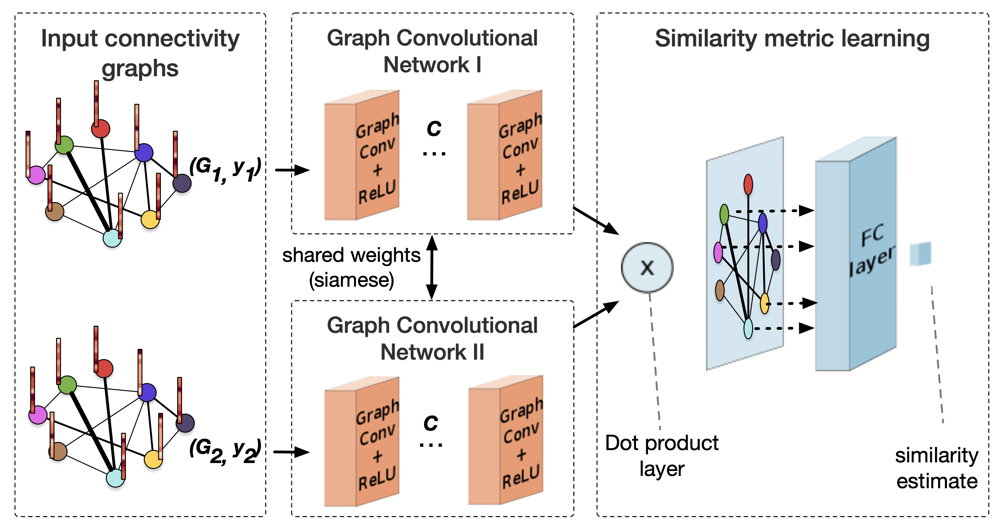

# Metric Learning using Graph Convolutional Neural Networks (GCNs)

The code in this repository implements a metric learning approach for irregular
graphs. The method has been applied on brain connectivity networks and is
presented in our papers:

* Sofia Ira Ktena, Sarah Parisot, Enzo Ferrante, Martin Rajchl, Matthew Lee,
  Ben Glocker, Daniel Rueckert, [Metric learning with spectral graph convolutions on brain connectivity networks](https://www.sciencedirect.com/science/article/pii/S1053811917310765), NeuroImage, 2018.

* Sofia Ira Ktena, Sarah Parisot, Enzo Ferrante, Martin Rajchl, Matthew Lee,
  Ben Glocker, Daniel Rueckert, [Distance Metric Learning using Graph Convolutional
  Networks: Application to Functional Brain Networks](https://arxiv.org/abs/1703.02161), Medical Image Computing
  and Computer-Assisted Interventions (MICCAI), 2017.

<p align="center">

</p>

(a) Estimation of single subject connectivity matrix and labelled graph representation. Pear- son’s correlation is used to obtain a functional connectivity matrix from the raw fMRI time- series. After specifying the graph structure for all subjects, based on spatial or functional information, each row/column of the connectivity matrix serves as a signal for the correspond- ing node (node label).

<p align="center">

</p>

(b) Siamese graph convolutional neural network for metric learning. A pair of graphs with the same structure but different signals is fed to this network, which outputs a similarity estimate between the two graphs. A same class (matching) / different class (non-matching) binary label is used for each pair during training.


The code is released under the terms of the [MIT license](LICENSE.txt). Please
cite the above paper if you use it.

There is also implementations of the filters and graph coarsening used in:
* Michaël Defferrard, Xavier Bresson, Pierre Vandergheynst, [Convolutional Neural
  Networks on Graphs with Fast Localized Spectral Filtering](https://arxiv.org/abs/1606.09375), Neural
  Information Processing Systems (NIPS), 2016.

The implementaton of the global loss function is based on:
* Vijay Kuma, Gustavo Carneiro, Ian Reid, [Learning Local Image Descriptors with Deep
  Siamese and Triplet Convolutional Networks by Minimising Global Loss Functions](https://arxiv.org/abs/1512.09272),
  IEEE Conference on Computer Vision and Pattern Recognition (CVPR), 2016.

## Installation

1. Clone this repository.
   ```sh
   git clone https://github.com/sk1712/gcn_metric_learning
   cd gcn_metric_learning
   ```

Added:
```
conda create -n gcn-metric-learning python=3.6 ipython -y && conda activate gcn-metric-learning
```
and to the `requirements.txt` for the MacOS:

```
#https://storage.googleapis.com/tensorflow/linux/cpu/tensorflow-0.10.0-cp34-cp34m-linux_x86_64.whl
#https://storage.googleapis.com/tensorflow/linux/gpu/tensorflow-0.10.0-cp34-cp34m-linux_x86_64.whl
https://storage.googleapis.com/tensorflow/mac/cpu/tensorflow-0.10.0-py3-none-any.whl
```
then:

```shell
conda activate gcn-metric-learning
```

2. Install the dependencies. Please edit `requirements.txt` to choose the
   TensorFlow version (CPU / GPU, Linux / Mac) you want to install, or install
   it beforehand.
   ```sh
   pip install -r requirements.txt  # or make install
   ```

## Using the model

To use our siamese graph ConvNet on your data, you need:

1. pairs of graphs as matrices where each row is a node and each column is a node feature,
2. a class label for each graph,
3. an adjacency matrix which provides the structure as a graph; the same structure
   will be used for all samples.

Please get in touch if you are unsure about applying the model to a different
setting.
